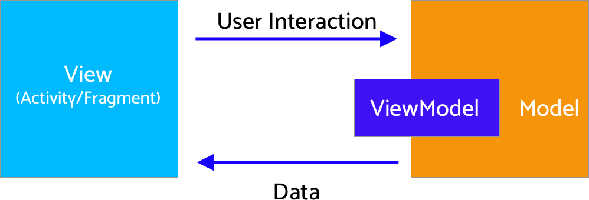
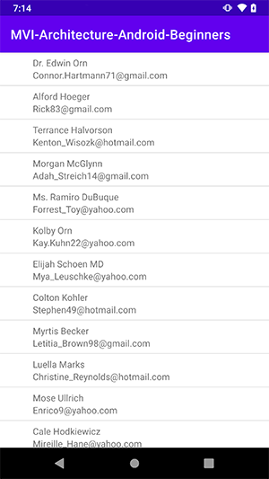

# Android MVI Architecture
This repository contains a sample app that implements MVI architecture using Kotlin, ViewModel, LiveData, and etc.



## Screenshots


## Libraries used
* [Retrofit2](https://github.com/square/retrofit) 
  * `implementation 'com.squareup.retrofit2:retrofit:2.9.0'`
  * `implementation 'com.squareup.retrofit2:converter-gson:2.9.0'`  
* [OkHttp](https://github.com/square/okhttp)
  * `implementation 'com.squareup.okhttp3:logging-interceptor:4.9.0'`  
* [ViewModel and LiveData](https://developer.android.com/topic/libraries/architecture/adding-components)
    * `implementation 'android.arch.lifecycle:extensions:2.3.1'`
* [Glide](https://github.com/bumptech/glide)
    * `implementation 'com.github.bumptech.glide:glide:4.12.0'`
    * `annotationProcessor 'com.github.bumptech.glide:compiler:4.12.0'`
 * [Glide](https://developer.android.com/kotlin/coroutines)
    * `implementation 'org.jetbrains.kotlinx:kotlinx-coroutines-android:1.4.3-native-mt'`
    * `implementation 'org.jetbrains.kotlinx:kotlinx-coroutines-core:1.4.3-native-mt'`
    
## API Used
- [x] [MockApi](https://5e510330f2c0d300147c034c.mockapi.io/)

## License & Copyright
```
Copyright 2021 Masoud Khoshkam.

Licensed under the Apache License, Version 2.0 (the "License");
you may not use this file except in compliance with the License.
You may obtain a copy of the License at

   http://www.apache.org/licenses/LICENSE-2.0

Unless required by applicable law or agreed to in writing, software
distributed under the License is distributed on an "AS IS" BASIS,
WITHOUT WARRANTIES OR CONDITIONS OF ANY KIND, either express or implied.
See the License for the specific language governing permissions and
limitations under the License.
```
